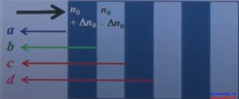
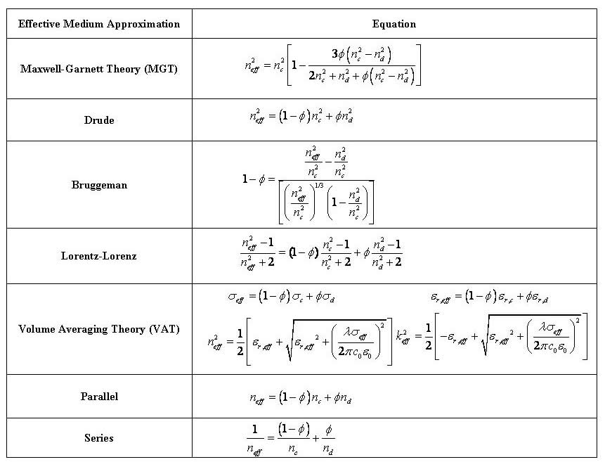

<link rel="stylesheet" href="index.css">
<nav>
  <a href="/Long-Period-Fibre-Gratings/logbook.html">Logbook</a>
  <a href="/Long-Period-Fibre-Gratings/1-notes.html">Notes</a>
  <a href="/Long-Period-Fibre-Gratings/code.html">Code</a>
</nav>

# Fibre Optics - Modes of a Fibre <!-- omit in toc -->

## Table of Contents <!-- omit in toc -->

- [1.0 Introduction](#10-introduction)
  - [Single-Mode and Multi-Mode Fibres (SMF & MMF)](#single-mode-and-multi-mode-fibres-smf--mmf)
    - [Step and Graded Indices](#step-and-graded-indices)
- [2.0 Optical Fibre Fabrication](#20-optical-fibre-fabrication)
  - [Common Materials](#common-materials)
    - [Glass](#glass)
    - [Halide Glass](#halide-glass)
    - [Active Glass](#active-glass)
    - [Chalcogenide Glass](#chalcogenide-glass)
    - [Polymer](#polymer)
  - [Fabrication](#fabrication)
    - [Fabrication of Pre-Form](#fabrication-of-pre-form)
      - [Chemical Processes](#chemical-processes)
      - [Methods](#methods)
      - [Modified Chemical Vapour Deposition](#modified-chemical-vapour-deposition)
      - [Outside Vapour Deposition](#outside-vapour-deposition)
    - [Drawing Fibre from the Pre-Form](#drawing-fibre-from-the-pre-form)
    - [Fibre Bundle](#fibre-bundle)
- [3.0 Transmission Characteristics](#30-transmission-characteristics)
  - [Optical Attenuation](#optical-attenuation)
    - [Loss Mechanisms](#loss-mechanisms)
      - [Absorptive](#absorptive)
      - [Radiative](#radiative)
      - [Rayleigh Scattering](#rayleigh-scattering)
      - [Fresnel Reflection](#fresnel-reflection)
  - [Pulse Broadening](#pulse-broadening)
    - [Gaussian Pulse](#gaussian-pulse)
    - [Intermodal Dispersion](#intermodal-dispersion)
- [4.0 Optical Fibre Gratings](#40-optical-fibre-gratings)
  - [Fibre Bragg Gratings](#fibre-bragg-gratings)
    - [Coupled Mode Theory](#coupled-mode-theory)
    - [Reflectivity](#reflectivity)
    - [Spectral Width](#spectral-width)
  - [Long Period Gratings](#long-period-gratings)
- [5.0 Effective Optical Properties of Nanoporous Materials](#50-effective-optical-properties-of-nanoporous-materials)
  - [Background](#background)

# 1.0 Introduction

Modal analysis is needed to accurately determine the light propagation behaviour.

For transmitting light through a fibre, modal analysis is needed to optomise the propagation behaviour of the light throughout the fibre. For example, how the intensity pattern changes as the light propagates through the fibre.

The first field pattern is random, and is not uniform throughout the length of the fibre.
In the above, field patterns which are sustained throughout the length of the fibre is called a mode of the fibre. The velocity of each mode can be unique.

**NOTE:** _Is the velocity of each mode unique? (Effective refractive index) Or, can the light field have a different pattern, but the same velocity profile?_

In the above, the random field pattern is fully within the one medium (core) of the fibre. This means the velocity can be described as:

$$
\tag{1}
v = \frac{c}{n}
$$

The second section shows an example of when a mode propagates partially in the core, and partially in the cladding. The effective refractive index is described with:

$$
\tag{2}
n_2 < n_{eff} < n_1
$$

Proportion of field in the core and in the cladding for different modes is different, hence their $n_{eff}$ are different. That is, different modes travel with different velocities.

**Guided Modes:** modes for which the field is mostly confined to the core

**Radiation Modes:** modes for which the field radiates out in the cladding - $n_{eff} < n_2$

These modes are orthogonal, and form a complete set. Any arbitrary field distribution can be expressed as a superposition of _guided_ and _radiation_ modes.

Therefore, since it is possible to completely define the propagation of individual modes, it is possible to predict the evolution of an arbitrary field pattern, based on _guided_ and _radiation_ modes.

For a given core and cladding radius, the number of modes depends on the numerical appature ($A_N$), core radius ($a$), and the wavelength of light ($\lambda$).

- A fibre with a lower numerical appature has fewer modes
- A fibre with a smaller core has fewer modes

Integrating the above parameters gives the _normalised frequency_:

$$
\tag*{where $A_N=\sqrt{n_1^2-n_2^2} \qquad (3)$}
V = \frac{2\pi}{\lambda_0}aA_N \kern{10em}
$$

## Single-Mode and Multi-Mode Fibres (SMF & MMF)

| Normalised Frequency | Fibre Mode  |
| -------------------- | ----------- |
| $V \ll 2.4048$       | Single-Mode |
| $V \gg 2.4048$       | Multi-Mode  |
| $V \approx 2.4048$   | Few-Mode    |

| Single-Mode Fibre                                            | Multi-Mode Fibre                                             |
| ------------------------------------------------------------ | ------------------------------------------------------------ |
| Long Haul Communication                                      | Local Area Networks                                          |
| Core Diameter $\backsim 10\mu m$                             | Core Diameter $\backsim 50\mu m$                             |
| Light Source - Laser Diode                                   | Light Source - LED                                           |
| Difficult to Couple Light                                    | Easier to Couple Light                                       |
| Difficult to Splice Fibres                                   | Not Necessary to Splice Fibres                               |
| Precision Equipment/Components Required                      | Cheaper System Components                                    |
| Silica Glass: $\Delta = 0.003, A_N \backsim 0.1, a = 5\mu m$ | Silica Glass: $\Delta = 0.01, A_N \backsim 0.2, a = 25\mu m$ |

### Step and Graded Indices

# 2.0 Optical Fibre Fabrication

## Common Materials

### Glass

- Fused silica glass (A.K.A silicate glass)
- Currently, the most widely used material for telecommunication fibre
- Low power losses
- Chemically inert
- Optically stable throughout material
- High glass transition temperature

### Halide Glass

- Flouride glass
- Low transmission losses at mid-infrared wavelengths
- Composition: $ZrF_4$, and $BaF_2, LaF_3, AlF_3, NaF$
- Under development for $2\mu m$ systems

### Active Glass

- Rare earth doped glass
- $Er$/$Nd$/$Tm$ doped within fused silica
- Used in optical fibre amplifiers, and fibre lasers

### Chalcogenide Glass

- Composition: $As_{40}S_{58}Se_2$ / $As_2S_3$
- High optical non-linearity (long interaction length)
- High losses (~$1 dBm^{-1}$)
- Used in mid-infrared sources, fibre amplifiers, and switches

### Polymer

- Composition: Polymethyl methacrylate / perfluorinated polymer
- High losses (~$0.2 dBm^{-1}$)
- Cheap to manufacture
- Light weight, and easy to install
- Dimensionally large
- Used in short distance communication (~$100 m$), sensing, and lighting

## Fabrication

### Fabrication of Pre-Form

The Pre-Form determines the reflective index profile, geometry of core and cladding, and core concentricity. The quality determines the propagation characteristics of the final fibre.

**NOTE:** _$Germanium$ develops colour-centres, which absorbs ionising radiation. Hence, $Flourine$ is used as the cladding with undoped-core, when in an environment with ionising, nuclear radiation_

#### Chemical Processes

$$

SiCl_4 + O_2 \rightarrow SiO_2 + 2Cl_2 \\
GeCl_4 + O_2 \rightarrow GeO_2 + 2Cl_2 \\
4POCl_3 + 3O_2 \rightarrow 2P_2O_5 + 6Cl_2 \\
TiCl_4 + O_2 \rightarrow TiO_2 + 2Cl_2 \\
4BCl_3 + 3O_2 \rightarrow 2B_2O_3 + 6Cl_2

$$

#### Methods

| Flame Hydrolysis               | Chemical Vapour Deposition                  |
| ------------------------------ | ------------------------------------------- |
| Vapour Axial Deposition        | Modified Chemical Vapour Deposition         |
| Outside Vapour Phase Oxidation | Plasma Modified Chemical Vapour Deposition  |
| Outside Vapour Deposition      | Plasma Activated Chemical Vapour Deposition |

#### Modified Chemical Vapour Deposition

A gaseous mixture of reactants is fed at the end of a rotating, silica tube. The tube is heated by a traversing, oxi-hydrogen burner. Glass particles (soot) are deposited on the internal tube wall. A thin, glass layer is formed, as the soot is vitrified by the burner. Finally, the temperature of the burner is increased to ~$2000 \degree C$, in order for the tube to collapse into a solid preform.

#### Outside Vapour Deposition

Layer by layer, soot is deposited on an aluminium oxide, or graphite, mandrel. After deposition, the central mandrel is removed. Finally, the hollow, porous preform is dehydrated and collapsed in an inert environment, through sintering.

### Drawing Fibre from the Pre-Form

Using a precision-controlled, feeding mechanism, preform is lowered into the high-purity graphite furnace. Gravity draws the glass into a glob. Acrylic is coated on the fibre, and cured in a furnace, before the final diameter is measured. Finally, the fibre is wound on a drum.

### Fibre Bundle

**Coherent Bundle** - the relative positions of the fibres at the input and output are the same.

- Image is not scrambled
- Used in endoscopy

**Incoherent Bundle** - the fibres are not aligned in a particular way.

- Image is scrambled
- Used as a coder or illumination
- Decoded using a similar bundle

# 3.0 Transmission Characteristics

## Optical Attenuation

$$
\tag{4}
Loss = 10 \log{(\frac{P_{in}}{P_{out}})}
$$

Loss Coefficient, $\alpha$, with $L$ in $m$:

$$
\tag{5}
\alpha = \frac{10}{L} \log{(\frac{P_{in}}{P_{out}})}  dBm^{-1}
$$

### Loss Mechanisms

#### Absorptive

- Intrinsic - Absoption by primary constituent materials of fibre
  - Caused by atomic vibration bands in the wavelength range (e.g. For $SiO_2$ near-IR region)
  - A result of interaction between vibrating chemical bonds and electromagnetic fields of the light
  - Electronic absoption bands in certain wavelength regions (e.g. For $SiO_2/Ge$ in ultra-violate region)
- Extrinsic - due to absoption by impurities

#### Radiative

- Rayleigh Scattering - Caused by small-scale inhomogeneities frozen into the fibre at the time of fabrication
- Fresnel Reflection - Power reflected back into the fibre at the output end

#### Rayleigh Scattering

Scattering in pure, fused silica:

$$
\tag{6}
\alpha (\lambda) = \alpha_{0} (\frac{\lambda_0}{\lambda})^4
$$

#### Fresnel Reflection

$$
\tag{7}
\text{Reflected Power} = \frac{(n_1-n_0)^2}{(n_1+n_0)^2}
$$

## Pulse Broadening

### Gaussian Pulse

$$
\tag{8}
P(t, z=0) = P_0 e^{-\frac{2(t-t_0)^2}{\tau_0^2}}
$$

$$
\tag{9}
P(t, z) = \frac{\tau_0 P_0}{\tau} e^{-\frac{2(t-t_z)^2}{\tau^2}} \kern{10em}
$$

_
where $\tau^2 = \tau_0^2 + \Delta \tau^2$
_

### Intermodal Dispersion

$$
\tag{10}
t = \frac{AC + CB}{c/n_1} \\
AC\cos{\theta} = \frac{AB}{2}, \qquad CB\cos{\theta} = \frac{AB}{2} \\
AC + CB = \frac{AB}{\cos{\theta}} \\
t = \frac{n_1L}{c\cos{\theta}} \Rightarrow t = \frac{n_1AB}{c\cos{\theta}}
$$

Total Internal Reflection: $\theta : 0 < \theta < \theta_c$

$$
\tag{11}
t_{\min} = n_1\frac{L}{c} \mid_{\theta = 0}
$$

$$
\tag{12}
\begin{aligned}
t_{\max} &= n_1\frac{L}{c\cos{\theta_c}} \mid_{\theta = \theta_c} \\
&= \frac{n_1^2L}{cn_2}
\end{aligned}
$$

# 4.0 Optical Fibre Gratings

## Fibre Bragg Gratings

Condition for strong reflection

$$
\tag{13}
\begin{aligned}
\Delta \phi_{ab} &= \pi - \frac{2\pi}{\lambda_0}(n_0 + \Delta n_0)\Lambda \\
\Delta \phi_{bc} &= \pi + \frac{2\pi}{\lambda_0}(n_0 - \Delta n_0)\Lambda
\end{aligned}
$$

For constructive interference at $\lambda_B$ between waves $a$, $b$, and $c$

$$
\tag{14}
\Delta \phi_{bc} - \Delta \phi_{ab} = 2\pi \Rightarrow \lambda_B = 2n_0\Lambda
$$

_
where $\Delta n_0 \ll n_0$
_

### Coupled Mode Theory

The Fibre Bragg gratings act as pertubations which enable the coupling of light between the forward and backward propagating modes

$$
\tag{15}
\beta^+ = \beta^- = \beta = \frac{2\pi}{\lambda_0}n_{eff} \kern{1em}\text{and}\kern{1em} K = \frac{2\pi}{\Lambda}
$$

With phase-matching at wavelength $\lambda_B$

$$
\tag{16}
2\frac{2\pi}{\lambda_B}n_{eff} = \frac{2\pi}{\Lambda} \Rightarrow \lambda_B = 2n_{eff}\Lambda
$$

If $A(z)$ and $B(z)$ are the amplitudes of forward and backward propagating modes:

$$
\tag{17}
\begin{aligned}
\frac{dA}{dz} &= \kappa B e^{i\Gamma z} \\
\frac{dB}{dz} &= \kappa A e^{-i\Gamma z} \kern{10em}
\end{aligned}
$$

_
where $\Gamma = 2\beta-K$
_

If $\Delta n_z^2(x,y,z) = n^2(x,y)+\Delta n_0^2\sin{Kz}$ represents the refractive index variation in the grating

$$
\tag{18}
\kappa = \frac{\omega \epsilon_0}{8} \iint \psi^* \Delta n^2(x,y)\psi \; dx dy \kern{10em}
$$

_where $\psi$ - normalized modal field_

For a single mode fibre with Gaussian approximation, the overlap integral:

$$
\tag{19}
I \approx 1 - e^{-2a^2/w^2}
$$

_
where $a$ - core radius, $w$ - Gaussian spot size of mode
_

$$
\tag{20}
\therefore \kappa \approx \frac{\pi \Delta n_0 I}{\lambda_B}
$$

### Reflectivity

$$
\tag{21}
R = \frac{\kappa^2 \sinh^2(\gamma L)}{\gamma^2 \cosh^2(\gamma L) + \frac{\Gamma^2}{4}\sinh^2(\gamma L)}
$$

_
where $\gamma^2 = \kappa^2 - \Gamma^2/4$
_

At Bragg wavelength $\lambda_B$:

$$
\tag{22}
2\beta = K \Rightarrow \Gamma = 0 \text{and } \gamma = \kappa \\
\rightarrow R = \tanh^2(\kappa L)
$$

### Spectral Width

$$
\tag{23}
\Delta \lambda = \frac{\lambda_B^2}{n_{eff}L}\sqrt{1+\frac{\kappa^2L^2}{\pi^2}}
$$

## Long Period Gratings

# 5.0 Effective Optical Properties of Nanoporous Materials

## Background

As previsouly mentioned, the optical properties of thin films can be tuned by introducing nanopores with different shape, size, and spatial distribution. The complex index of refraction ($m=n-ik$) of nanoporous thin films with various morphologies can be determined for incident electromagnetic waves by numerically solving Maxwell's equations. Here, n is the index of refraction and k is the absorption index. Polarization of an incident electromagnetic wave describes the direction of the electric field with respect to the plane of incidence defined by the Poynting vector and the normal vector of the surface on which it is incident. In transverse electric (TE) plane waves, the electric field is perpendicular to the plane of incidence while it is in that plane for transverse magnetic (TM) plane waves. Any arbitrary plane wave can be described as some combination of TE and TM waves. For a dense homogeneous film, the normal vector of the surface and the Poynting vector are collinear such that the plane of incidence and hence polarization cannot be defined. For a heterogeneous film such as the films considered here, the normal vector is no longer collinear with the Poynting vector allowing polarization to be defined that causes changes in transmittance and reflectance. The numerical results can then be compared with predictions from widely used effective medium approximations (EMAs).

---

<footer>
  
Majority of content comes from XoviabECE: Fiber Optics - NPTEL Online Certification Course

  
As interpretted and summated by Shaun Hamilton

</footer>
